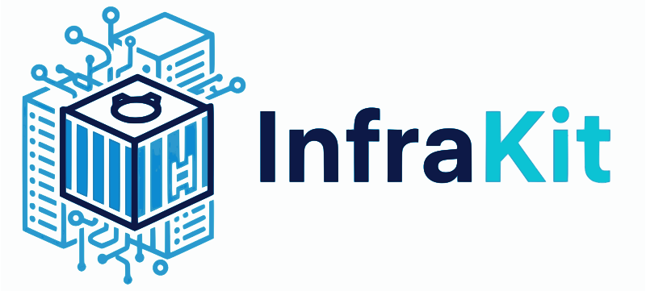

# InfraKit Branding Guide

This guide explains how to properly use InfraKit's branding assets and maintain consistent visual identity across all materials.

## Brand Assets Overview

### Logo Variants

| Asset | Use Case | Dimensions | File Size |
|-------|----------|------------|-----------|
| **Full Logo** | Headers, main documentation, presentations | Variable | Web-optimized SVG/144KB PNG |
| **Icon Only** | Avatars, social media, compact spaces | 200x200px | Web-optimized SVG/195KB PNG |
| **Wordmark Only** | Text-based branding, footers | Variable | Web-optimized SVG |
| **Optimized Icons** | Performance-critical applications | 64-256px | 7-61KB |
| **Favicon** | Browser tabs, bookmarks | 16-48px | 1-15KB |
| **Social Media** | Open Graph, Twitter cards | 1200x630px | 76KB |

### File Structure
```
assets/
├── logo/
│   ├── infrakit-logo-full.png          # Full logo with wordmark (optimized)
│   ├── infrakit-logo-full.svg          # Full logo (web-optimized SVG)
│   ├── infrakit-logo-icon.png          # Clean icon only (optimized)
│   ├── infrakit-logo-icon.svg          # Icon only (web-optimized SVG)
│   └── infrakit-wordmark.svg           # Wordmark only (web-optimized SVG)
├── favicon/
│   ├── favicon.ico                     # Multi-size ICO
│   └── favicon-{size}.png              # Various sizes
├── optimized/
│   └── icon-{size}.png                 # Performance variants
└── social/
    ├── og-image.png                    # Open Graph
    └── twitter-card.png                # Twitter Card
```

## Usage Guidelines

### Primary Logo (`infrakit-logo-full.png`)
- **Use for**: Main headers, documentation covers, presentations
- **Minimum size**: 200px wide
- **Clear space**: 20px on all sides
- **Background**: Works on both light and dark backgrounds

### Icon Only (`infrakit-logo-icon.png`)
- **Use for**: Profile pictures, avatars, compact layouts
- **Minimum size**: 32px × 32px
- **Clear space**: 8px on all sides
- **Background**: Transparent, works on any background

### Wordmark Only (`infrakit-wordmark.svg`)
- **Use for**: Text-based branding, footers, secondary locations
- **Minimum size**: 100px wide
- **Clear space**: 10px on all sides
- **Background**: Transparent, works on any background

### Optimized Assets
- **Use for**: Performance-critical applications
- **Benefits**: Smaller file sizes, faster loading
- **Formats**: Multiple sizes available (64px, 128px, 256px)

### Vector Assets (SVG)
- **Use for**: High-quality printing, scalable applications, modern web
- **Benefits**: Crisp at any size, lossless scaling, web-optimized
- **Formats**: Full logo, icon, and wordmark available
- **Note**: All SVG files are now web-optimized with reasonable file sizes
- **Recommendation**: Use SVG for modern applications, PNG for legacy support

#### SVG File Sizes (Web-Optimized)
- `infrakit-logo-full.svg`: Web-optimized
- `infrakit-logo-icon.svg`: Web-optimized  
- `infrakit-wordmark.svg`: Web-optimized

#### When to Use SVG vs PNG
- **SVG**: Modern web applications, high-quality print materials, scalable interfaces
- **PNG (Optimized)**: Legacy browser support, specific size requirements, social media

## Implementation Examples

### Markdown Headers
```markdown
# Project Name

<div align="center">

</div>
```

### HTML Integration
```html
<!-- Full logo (web-optimized SVG - recommended) -->


<!-- Full logo (PNG fallback) -->


<!-- Icon only (web-optimized SVG - recommended) -->


<!-- Icon only (PNG fallback) -->


<!-- Wordmark only (SVG) -->


<!-- Favicon -->
<link rel="icon" href="assets/favicon/favicon.ico" type="image/x-icon">
```

### Favicon Implementation
```html
<!-- Multi-format favicon support -->
<link rel="icon" href="assets/favicon/favicon.ico" type="image/x-icon">
<link rel="icon" type="image/png" sizes="16x16" href="assets/favicon/favicon-16x16.png">
<link rel="icon" type="image/png" sizes="32x32" href="assets/favicon/favicon-32x32.png">
```

## Color Palette

### Primary Colors
- **InfraKit Blue**: `#2563eb` (RGB: 37, 99, 235)
- **Docker Blue**: `#0db7ed` (RGB: 13, 183, 237)
- **Success Green**: `#10b981` (RGB: 16, 185, 129)
- **Warning Orange**: `#f59e0b` (RGB: 245, 158, 11)
- **Error Red**: `#ef4444` (RGB: 239, 68, 68)

### Neutral Colors
- **Dark Gray**: `#1f2937` (RGB: 31, 41, 55)
- **Medium Gray**: `#6b7280` (RGB: 107, 114, 128)
- **Light Gray**: `#d1d5db` (RGB: 209, 213, 219)
- **Background**: `#f9fafb` (RGB: 249, 250, 251)

## Social Media Specifications

### GitHub Repository
- **Avatar**: Use `logo/infrakit-logo-icon.svg` (scalable) or `optimized/icon-256x256.png` (256x256px)
- **Social Preview**: Use `social/og-image.png`
- **README Header**: Use `logo/infrakit-logo-full.svg`

### Twitter/X
- **Profile Picture**: Use `optimized/icon-256x256.png` (256x256px)
- **Header Image**: Use `social/twitter-card.png` (1200x600px)
- **Tweet Images**: Use `logo/infrakit-logo-full.svg`

### LinkedIn
- **Company Logo**: Use `optimized/icon-256x256.png` (256x256px)
- **Cover Image**: Use `social/og-image.png` (1200x630px)

## Usage Restrictions

### Don't:
- Alter the logo colors or proportions
- Add effects, shadows, or distortions
- Use the logo on busy backgrounds without clear space
- Combine with other logos without proper spacing
- Use low-resolution versions when high-res is available

### Do:
- Maintain clear space around logos
- Use appropriate sizes for each medium
- Ensure good contrast with backgrounds
- Keep logos crisp and clear
- Use consistent branding across all materials

## Quick Reference

### Common Sizes
- **Favicon**: 16px, 32px, 48px, 64px
- **Social Media**: 200px, 400px, 512px
- **Headers**: 300px, 400px, 600px
- **Presentations**: 800px, 1200px

### File Formats
- **SVG**: Best for modern web applications, scalable interfaces, print materials
- **PNG**: Best for legacy browser support, specific size requirements
- **ICO**: For favicon compatibility across all browsers
- **Optimized PNG**: For performance-critical applications with specific size needs

### Integration Checklist
- Choose appropriate asset size
- Ensure proper clear space
- Test on both light and dark backgrounds
- Verify crisp rendering at target size
- Include appropriate alt text
- Optimize for web if needed

---

## Questions?

If you have questions about brand usage or need additional assets, please:
1. Check this guide first
2. Review existing implementations
3. Open an issue on GitHub
4. Follow the established patterns

**Remember**: Consistent branding helps users recognize and trust InfraKit across all touchpoints.
